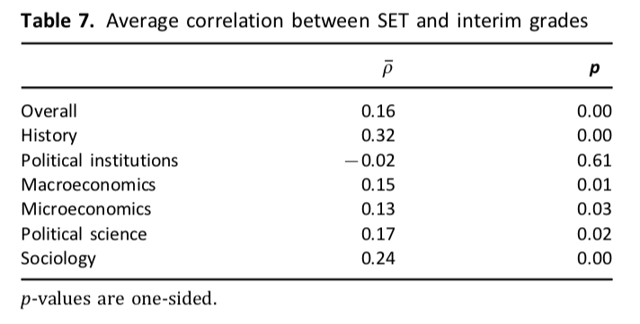
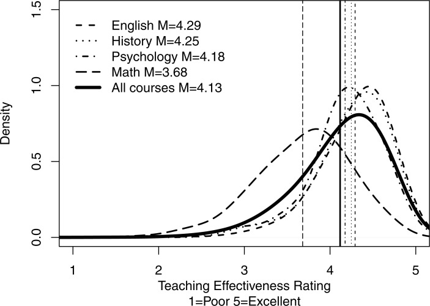
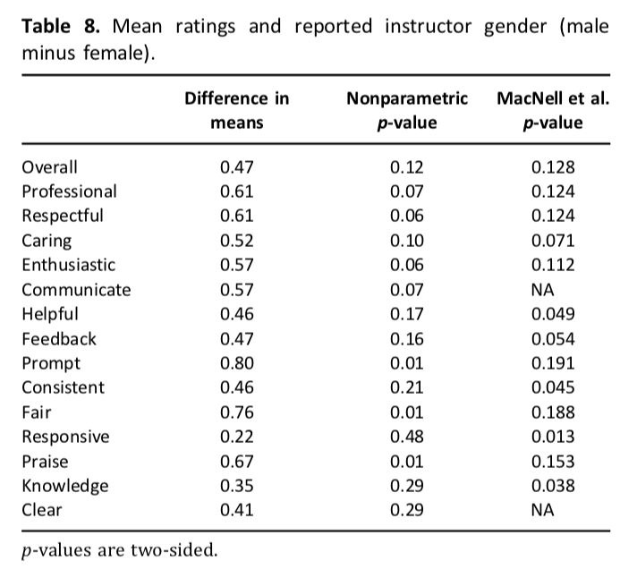
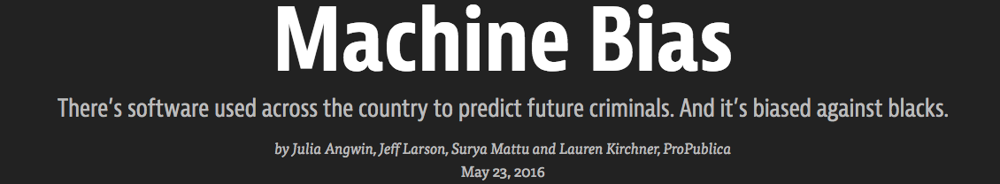
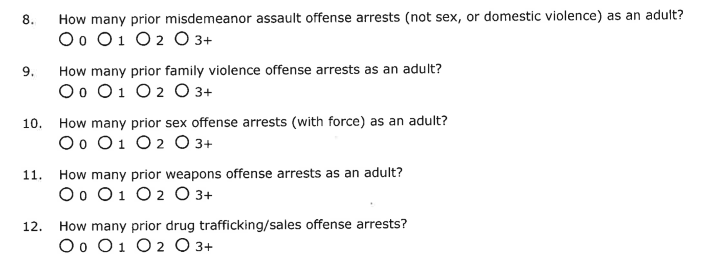
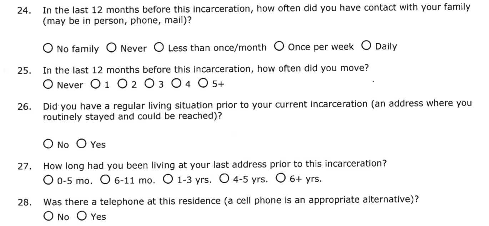
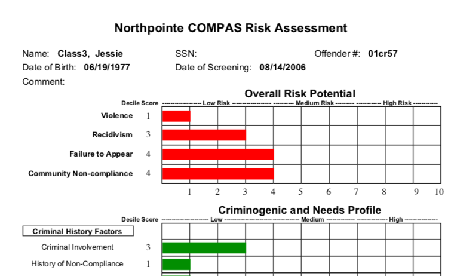
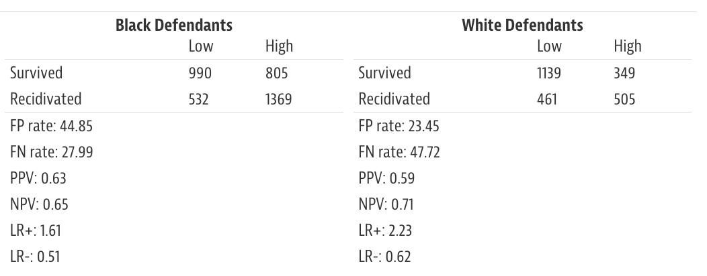

---
# YAML metadata
title: Using data to confuse and deceive
author: Matthew Brett
bibliography: [workshop.bib, data-science-bib/data_science.bib]
linkcolor: blue
urlcolor: blue
<#ifndef HANDOUT>
suppress-bibliography: true
<#endif>
---

# How to lie with statistics

> If you can’t prove what you want to prove, demonstrate something else and
> pretend that they are the same thing. In the daze that follows the collision
> of statistics with the human mind, hardly anybody will notice the difference.

[@huff1954lie]

# "Research Excellence" Framework

> Over thirty years the RAE / REF has supported a sustained improvement in the
> quality and productivity of the UK research base. It is used by universities
> to attract students, staff and external funding.

[Research Excellence Framework (REF) review: Building on success and learning
from
experience](https://www.gov.uk/government/uploads/system/uploads/attachment_data/file/541338/ind-16-9-ref-stern-review.pdf)
by Lord Nicholas Stern.

# What is improvement?

|    | 1947–66 | 1967–86 | 1987–2006 |
|----|---------|---------|-----------|
| US | 50      | 88      | 126       |
| UK | 20      | 25      | 9         |

Number of science Nobel prizes by country and time period.  REA / REF started
in 1986.

[@charlton2007scientometric]

# What is improvement?

> In contrast to the picture of long term decline in Nobel-prize-winning
> revolutionary science; UK and European scientific production (also that of
> Chinese science) is probably catching up with the USA in terms of
> scientometric measures such as numbers of publications and citations.

[@charlton2007scientometric]

# "Teaching Excellence" Framework

* student satisfaction using the teaching on course, assessment and feedback
  and academic support scales from the National Student Survey;
* retention using [Higher Education Statistics Agency] UK Performance
  Indicators;
* proportion in employment in further study using 6 month [Destination of
  Leavers from Higher Education Survey].

UK government [Higher education: success as a knowledge economy - white
paper](https://www.gov.uk/government/publications/higher-education-success-as-a-knowledge-economy-white-paper)

# Student Evaluations do not measure teaching effectiveness

{ height=80% }

[@uttl2017meta]

# Summary of meta analysis

> The reported correlations between [Student Evaluations of Teaching] ratings
> and learning are completely consistent with randomly generating correlations
> from the population correlation with rho = 0 and applying publication
> selection bias.

[@uttl2017meta]

# What do student ratings measure?

* the grade the student expects to get;
* the subject being taught;
* whether the instructor is white and male
* biscuits

# Expected grade

{ width=100% }

[@boring2016student]

# Subject being taught

{ width=80% }

14872 class summary evaluations from New York University

[@uttl2017student]

# Whether the instructor is male

{ height=80% }

[@boring2016student]

# Biscuits

> The cookie group evaluated teachers significantly better than the control
> group (113.4 $\pm$ 4.9 versus 109.2 $\pm$ 7.3; p = 0.001, effect size 0.68).
> Course material was considered better (10.1 $\pm$ 2.3 versus 8.4 $\pm$ 2.8;
> p = 0.001, effect size 0.66) and summation scores evaluating the course
> overall were significantly higher (224.5 $\pm$ 12.5 versus 217.2 $\pm$ 16.1;
> p = 0.008, effect size 0.51) in the cookie group.

[@hessler2018cookies]

# For discussion

* Given the data here, why did the government want to use student ratings to
  evaluate teaching?
* Imagine I propose an alternative rating of teaching excellence, which is
  a random number between 1 and 10.  Make arguments for preferring a metric based on student evaluations.
* If you could decide how to evaluate teaching, what do you propose?

# Algorithms and public policy

{ width=40% }

[@oneil2016weapons]

# Risk scores for re-offending

{width=100%}

Full analysis at <https://github.com/propublica/compas-analysis>

# COMPAS

"Correctional Offender Management Profiling for Alternative Sanctions"

Proprietary algorithm

Marketed by Northpointe

# Risk score officer questions

{width=100%}

[COMPAS
questionnaire](https://www.documentcloud.org/documents/2840632-Sample-Risk-Assessment-COMPAS-Risk-and-Pre.html)

# Risk score offender questions

{width=100%}

[COMPAS
questionnaire](https://www.documentcloud.org/documents/2840632-Sample-Risk-Assessment-COMPAS-Risk-and-Pre.html)

# Risk score results

{width=100%}

[COMPAS results](https://www.documentcloud.org/documents/2839240-Sample-Risk-Assessment-COMPAS-Results.html)

# Background - a crash course on machine learning

See <https://www.inferentialthinking.com/chapters/17/Classification>

# Prediction errors by race

{width=100%}

See this [description of the analysis](https://www.propublica.org/article/how-we-analyzed-the-compas-recidivism-algorithm).

# Garbage in, Gospel out

From [Garbage in, garbage
out](https://en.wikipedia.org/wiki/Garbage_in%2C_garbage_out)

# Assessing risk scores

> Although these measures were crafted with the best of intentions, I am
> concerned that they inadvertently undermine our efforts to ensure
> individualized and equal justice.

Eric Holder, US Attorney General, 2014 (quoted in Propublica).

# For discussion

* Given the importance of the risk scores, and their potential for bias, why
  was there so little study of their performance?
* What would be your recommendation for the use of the Northpointe system
  studied here?
* What recommendations would you make, to a state that was considering using
  a system like this?  What resources would you provide to help them?

# Is this the end?

Yes, it's the end.

<#ifdef HANDOUT>
# References
<#endif>
