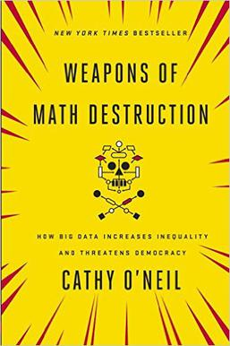

---
# YAML metadata
title: Using data to confuse and deceive
author: Matthew Brett
bibliography: data.bib
<#ifndef HANDOUT>
suppress-bibliography: true
<#endif>
---

# Handout

Available at
<https://github.com/matthew-brett/lans-workshop/blob/master/data_confuse_deceive_handout.pdf>

# An orientation

An answer to "What is data science?" through "How would we recognize data
science?"

# Algorithms

{ width=40% }

[@oneil2016weapons]

# Data journalism

{width=100%}

Full analysis at <https://github.com/propublica/compas-analysis>

# Is this the end?

Yes, it's the end of the workshop.

All material for these slides at
<https://github.com/matthew-brett/lans-workshop>

<#ifdef HANDOUT>
# References
<#endif>
